## A secured data access solution ##

This is a demo to present how to apply the following Azure Services to build a secured data transfer solution.
  * Azure Blob Storage
  * Azure Virtual Machine (VM)
  * Azure Conatiner Instance (ACI)
  * Azure Virtual Netwroks (VNet)
  * Azure Managed Identities

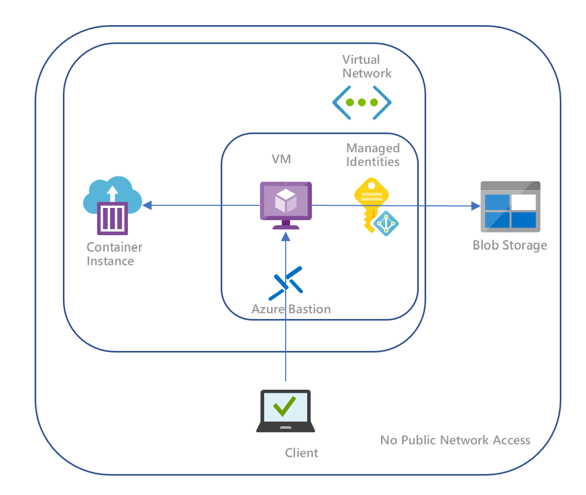

And the aims of this demo are
  * #### With VNet, no public access of Storage, VM and ACI ####
  * #### With Managed Identities, no security key or token is need, the access_token will be get via code ####
  
Here are the scripts to build the demo

1. #### Create the resource group ####
```Powershell
  az group create --name msirsgrp2021 --location westeurope
```

2. #### Create an Azure Container Instance (ACI) with an image 'aci-helloworld' and the ACI is in a VNet, so no public access to the ACI. ####
```Powershell
  az container create --resource-group msirsgrp2021 --name mycontainer --image mcr.microsoft.com/azuredocs/aci-helloworld --vnet aci-vm-vnet2 --vnet-address-prefix 10.0.0.0/16 --subnet aci-vm-subnet1 --subnet-address-prefix 10.0.0.0/24
```
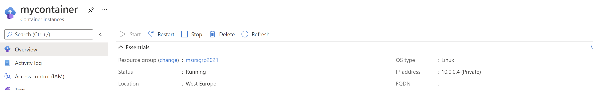

3. #### Create a subnet in Vnet and create a windows VM in the subnet, not assign a public IP, so no public access to the VM   ####

```Powershell
  az network vnet subnet create -g msirsgrp2021 --vnet-name aci-vm-vnet2  -n aci-vm-subnet2 --address-prefixes 10.0.1.0/24
  az vm create --resource-group msirsgrp2021 --name myWinVM --image win2016datacenter --admin-username azureuser --admin-password  AAbbccdd123! --vnet-name aci-vm-vnet2 --subnet aci-vm-subnet2 --public-ip-address ""
```

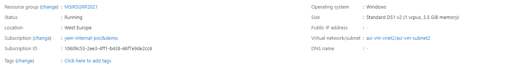
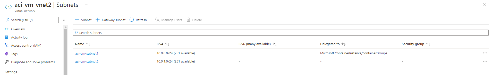


4. #### Enable the system-assigned identity to the VM ####
```Powershell
  az vm identity assign -g msirsgrp2021 -n myWinVM --identities [system]
```

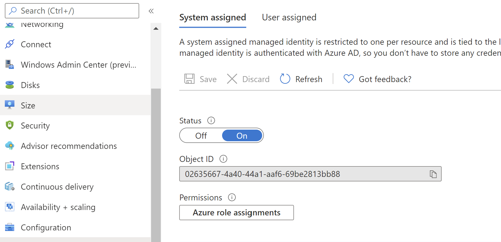


5. #### Create a storage account ####

```Powershell
  az storage account create -n msistorage20210210 -g msirsgrp2021 -l westeurope --sku Standard_LRS --kind BlobStorage --access-tier Hot
```

6. #### For the demo purpose, the code below creates a blob container and uploads a sample file to the storage.  #### 

```Powershell
  for /f %f in ('az storage account show-connection-string -g msirsgrp2021 -n msistorage20210210  --out tsv') do set conStr=%f
  az storage container create -n mystoragecontainer --connection-string %conStr%
  echo This is a test> test.txt
  az storage blob upload --account-name msistorage20210210 --connection-string %conStr% --container-name mystoragecontainer --file test.txt --name test.txt
```

7. #### Disable the public access of the storage, and create a networks rule, only allow the access from the VNet.  ####
  
```Powershell
  az storage account update -n msistorage20210210 -g msirsgrp2021 --bypass AzureServices --default-action Deny
  az network vnet subnet update -g msirsgrp2021 -n aci-vm-subnet2 --vnet-name aci-vm-vnet2 --service-endpoints Microsoft.Storage
  az storage account network-rule add -g msirsgrp2021 --account-name msistorage20210210 --vnet-name aci-vm-vnet2 --subnet aci-vm-subnet2
```

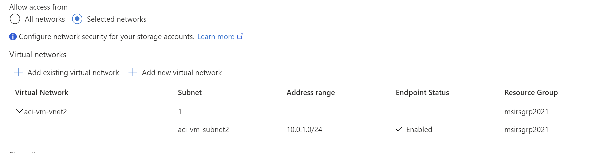

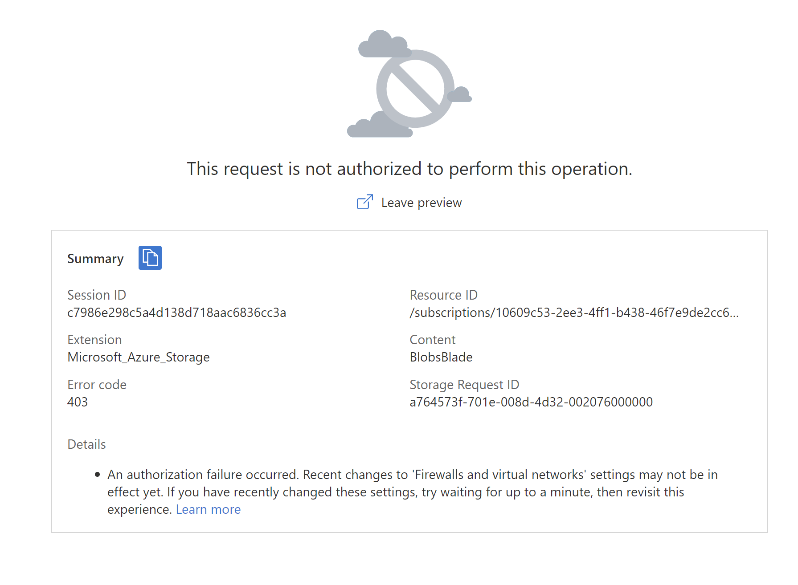

8.  #### Assign a role of 'Storage Blob Data Owner' to the VM so that it can access the Storage with the system-assigned identity. ####

```Powershell
  for /f %f in ('az resource list -n myWinVM -g msirsgrp2021 --query [*].identity.principalId --out tsv') do set spID=%f
  az role assignment create --assignee %spID% --role "Storage Blob Data Owner" --scope /subscriptions/10609c53-2ee3-4ff1-b438-46f7e9de2cc6/resourceGroups/msirsgrp2021/providers/Microsoft.Storage/storageAccounts/msistorage20210210
```


### Done! we have created all the services we need in this demo ###


Before we start the demo, we need a remote desktop connection to the Windows VM, while it has no public access, so we create Azure Bastion to make this connection.

```Powershell
  az network vnet subnet create -g msirsgrp2021 --vnet-name aci-vm-vnet2  -n AzureBastionSubnet --address-prefixes 10.0.2.0/24
  az network public-ip create --resource-group msirsgrp2021 --name MyBastionIp --sku Standard --location westeurope
  az network bastion create --name MyBastion --public-ip-address MyBastionIp --resource-group msirsgrp2021 --vnet-name aci-vm-vnet2 --location westeurope  
```
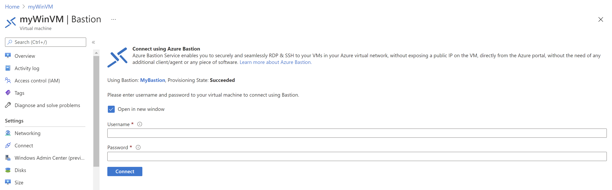

Here is the screenshot of all the services in the resource group.
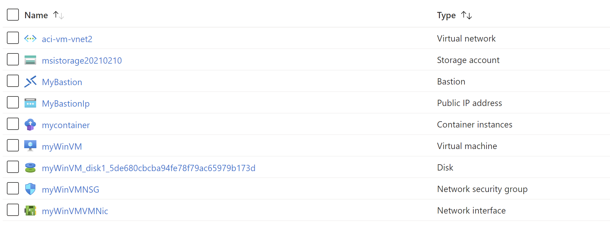

### Demo ###
Now we can use Bastion to access the windows VM, 

1. #### We can access the ACI based Web App with a web browser in the VM via the internal IP address (10.0.0.4) of the ACI. ####
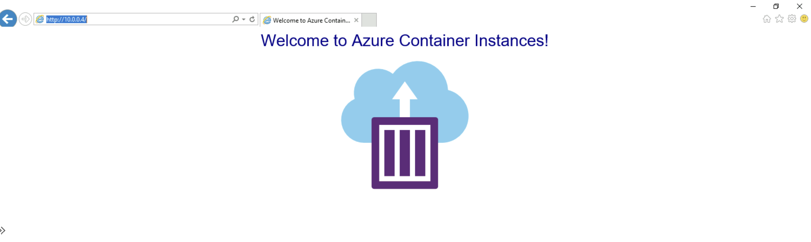

2. #### We use the Powershell script to demostrate we can access the blob with system-assigned identity, we don't need storage key or connection string here. ####
```Powershell
  $response = Invoke-WebRequest -Uri 'http://169.254.169.254/metadata/identity/oauth2/token?api-version=2018-02-01&resource=https%3A%2F%2Fdatalake.azure.net%2F' -Method GET -Headers @{Metadata="true"}
  $content = $response.Content | ConvertFrom-Json
  $AccessToken = $content.access_token
  $result = Invoke-WebRequest -Uri https://msistorage20210210.blob.core.windows.net/mystoragecontainer/test.txt -Headers @{"x-ms-version"="2017-11-09"; Authorization="Bearer $AccessToken"}
  $result.Content
```

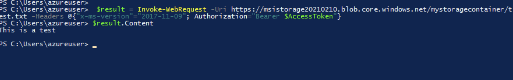


## Azure Function with Managed Identity to access blob ##

* ### Create an Azure Function with a Storage Account ###
```Powershell
az storage account create -n msifuncstorage20210226 -g msirsgrp2021 --kind StorageV2 --sku Standard_LRS
az storage container create --account-name msifuncstorage20210226 --name myblob 
az appservice plan create -n msisrvplan20210226 -g msirsgrp2021 --is-linux --sku B1
az functionapp create --resource-group msirsgrp2021 --consumption-plan-location westeurope --runtime python --runtime-version 3.8 --functions-version 3 --name msifunc20210226  --os-type linux --storage-account msifuncstorage20210226 
```


* ### Assign a system managed identity to the Function with Storage Blob Data Contributor role. ###
```Powershell
az functionapp identity assign -n msifunc20210226 -g msirsgrp2021 --role ba92f5b4-2d11-453d-a403-e96b0029c9fe --scope /subscriptions/10609c53-2ee3-4ff1-b438-46f7e9de2cc6/resourceGroups/msirsgrp2021/providers/Microsoft.Storage/storageAccounts/msifuncstorage20210226
```
The GUID ba92f5b4-2d11-453d-a403-e96b0029c9fe is the ID for the Storage Blob Data Contributor role. You can find all of the built-in Azure roles here: https://docs.microsoft.com/en-us/azure/role-based-access-control/built-in-roles


* ### Python code use managed identity to upload data to blob ###

```python
# Prepere content
content = uuid.uuid4().hex
local_file_name = content+'.txt'
account_url = 'https://msifuncstorage20210226.blob.core.windows.net/'

# Apply managed identity
default_credential = DefaultAzureCredential()
blob_service_client = BlobServiceClient(
    account_url = account_url,
    credential = default_credential
)

# Create blob client
blob_client = blob_service_client.get_blob_client(container='myblob', blob=local_file_name)

# Upload the created file
blob_client.upload_blob(content, overwrite=True)
```

* ### Publish the Function, which will upload a text file with managed identity instead of access key. ###
```
cd Functionproj
func azure functionapp publish msifunc20210226
```

* ### After published, access the function endpoint ###
```
curl https://msifunc20210226.azurewebsites.net/api/httpexample
```
It will return a GUID as the screenshot below, which means the data is uploaded to Storage

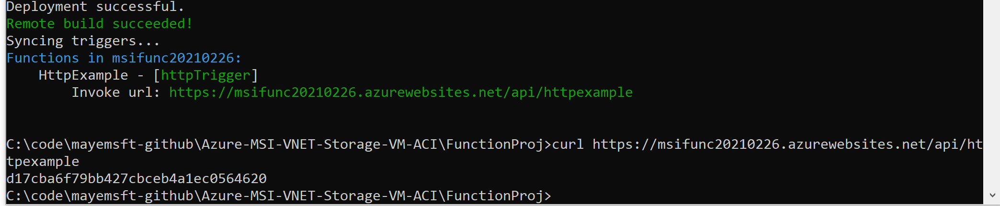


### Reference Links ###
* https://docs.microsoft.com/en-us/azure/active-directory/managed-identities-azure-resources/overview
* https://docs.microsoft.com/en-us/azure/active-directory/managed-identities-azure-resources/qs-configure-cli-windows-vm
* https://docs.microsoft.com/en-us/azure/container-instances/container-instances-quickstart
* https://azure.microsoft.com/en-us/services/azure-bastion/
* https://docs.microsoft.com/en-us/azure/azure-functions/create-first-function-cli-python?tabs=azure-cli%2Cbash%2Cbrowser
* https://pypi.org/project/azure-identity/1.4.0/
* https://blog.jongallant.com/2020/02/azure-functions-blob-managed-identity-part1/
* https://github.com/jongio/azure-blob-functions-managedid

### Azure CLI ### 
* https://docs.microsoft.com/en-us/cli/azure/network/vnet?view=azure-cli-latest
* https://docs.microsoft.com/en-us/cli/azure/vm?view=azure-cli-latest
* https://docs.microsoft.com/en-us/cli/azure/storage?view=azure-cli-latest

